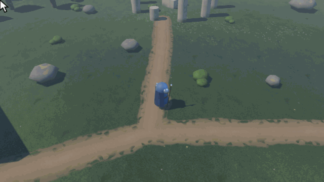

<!-- translation of README.md @ ed3c07c99517 -->
# Iso & Orbit - Template de câmera e controlador de personagem

[English](README.md) · [Español](README.es.md) · [日本語](README.ja.md) · **Português (Brasil)** · [Русский](README.ru.md) · [Türkçe](README.tr.md) · [简体中文](README.zh_CN.md)

> Esta é uma tradução do [original em inglês](README.md). Onde houver diferenças, a versão em inglês é a correta.

Versão 1.0.0 · Godot 4.7 (testado na 4.7.2) · GDScript · MIT

Um controlador de personagem de clicar para mover e uma câmera orbital para RPGs isométricos e de visão de cima.
Clique no chão e o herói corre até lá, contornando obstáculos; segure o botão e o herói segue o cursor. A câmera
orbita, dá zoom e não entra nas paredes.



Sem assets de terceiros: os personagens são montados a partir de primitivas por um script, os padrões das superfícies
são gerados por shaders e pré-calculados em texturas sem emendas, e os sons são sintetizados.

## Primeiros passos

1. Instale o Godot 4.7.2, a versão padrão ou a .NET. O Jolt Physics já vem embutido na engine, não há nada a
   instalar. O renderizador é o Forward+.
2. Clone o repositório, importe o `project.godot` no Gerenciador de Projetos (Project Manager) e abra-o. A primeira
   importação demora um pouco, pois `.godot/` não está no repositório.
3. Pressione F5 para rodar a demo (`res://gdscript/main.tscn`).

Os controles estão listados no canto superior esquerdo. Para ocultá-los, abra Configurações (F10) → Interface e
desligue **Dica de controles e velocidade**. O idioma da interface é escolhido na mesma aba.

## Controles

| Entrada | Ação |
|---|---|
| Clique esquerdo no chão | Correr até esse ponto |
| Segurar o botão esquerdo | Correr atrás do cursor |
| Botão esquerdo + direito | Correr para onde a câmera olha; A / D desviam na diagonal |
| Botão direito + mouse | Orbitar a câmera |
| Botão direito + WASD | Mover-se em relação à câmera |
| Roda do mouse | Zoom: mais baixo e mais perto, ou mais alto e mais longe |
| Shift | Corrida rápida enquanto segurado (ou alternar, nas configurações) |
| Espaço | Pular |
| F10 | Abrir as configurações (pausa o jogo); Esc ou F10 as fecha |

Todos os modos e suas configurações: [Controles](docs/pt_BR/controls.md).

## Recursos

**Movimento**

- Clique para correr até um ponto pela malha de navegação; um marcador mostra onde.
- Segure o botão esquerdo para correr atrás do cursor: por padrão direto até ele, deslizando ao longo dos obstáculos;
  opcionalmente por um caminho de navegação até o ponto sob ele.
- Clicar e segurar são diferenciados após 0,2 s, então segurar o botão nunca manda o herói fazer um desvio até o
  ponto onde você pressionou.
- Os dois botões juntos: correr para onde a câmera olha. Botão direito e WASD: mover-se em relação à câmera, olhando
  para a frente ou virando-se para onde você vai.
- Aceleração e frenagem constantes, parada exata no alvo sem passar do ponto, velocidade de giro limitada e giro
  instantâneo a partir da parada.
- Corrida rápida com fôlego. Pulo com coyote time e buffer de entrada; a altura do pulo é a mesma em qualquer taxa de
  ticks de física.
- Proteção de bordas: na beira de um desnível o herói para ou desliza ao longo dela, como numa parede.

**Câmera**

- Órbita com o botão direito, zoom com a roda. Distância e inclinação mudam juntas: quanto mais perto a câmera, mais
  baixo o seu ângulo, para você ver o que está à frente.
- Opcionalmente, vira para trás do herói em corrida e leva suavemente a inclinação a um ângulo definido.
- Enquanto a câmera gira, o cursor fica sobre o mesmo ponto do chão, então o botão segurado mantém o herói no rumo em
  vez de fazê-lo correr em círculos.
- Um braço de câmera: a câmera para numa parede, montanha ou telhado atrás dela e, opcionalmente, se aproxima quando
  um obstáculo esconde o herói. De perto, o herói fica translúcido.
- Atrás de obstáculos, o herói aparece como uma única silhueta com contorno, com o equipamento na mão desenhado por
  cima.

**Também incluído**

- Uma janela de configurações (F10) com abas de controles, personagem, câmera, exibição, interface e som, salvas em
  `user://settings.cfg`. A interface está em inglês, espanhol, japonês, português do Brasil, russo, turco e chinês
  simplificado, com troca em tempo real.
- Sinais do personagem para passos, pulos, aterrissagens e corrida rápida, com sons conectados a eles.
- Um nível de demonstração: uma clareira cercada de 80 × 80 m com ruínas, um acampamento, um sítio, um labirinto de
  sebes, uma rampa e uma montanha com uma trilha em espiral. Quatro locais para descobrir, com cinco NPCs posicionados
  neles, e dez aparências de herói para escolher.
- Testes headless de movimento, entrada, pulo, corrida rápida e sons, da câmera e seu braço, das aparências do herói,
  da janela de configurações e das traduções, e um script que encontra os avisos de nós do editor em todas as cenas
  sem abrir o editor.

**Não incluído:** suporte a gamepad (apenas mouse e teclado) e animações: os modelos são primitivas estáticas.

## Como as partes se encaixam

```
mouse, WASD ──► PointClickMoveInput ──move_to(point)────► NavigationMover ──► GroundMotion
                                    ──steer(direction)──► (caminho ou         (aceleração, frenagem,
                                                           direção)            giro: matemática pura)
                                                               │ velocidade
                                                               ▼
Shift, Space ──► CharacterActionInput ──────────────────► GroundCharacter
                                                          (CharacterBody3D: gravidade, pulo, corrida rápida,
                                                           move_and_slide, giro do modelo)

mouse ──► OrbitCameraRig ──► CameraArm ──► Camera3D
```

- **Só o `GroundCharacter` move o corpo.** Os componentes de movimento retornam uma velocidade e nunca chamam
  `move_and_slide()`, então gravidade, pulos e qualquer futuro knockback são combinados num só lugar.
- **`GroundMotion` é matemática sem nós**, fácil de testar isoladamente.
- **O personagem não sabe nada do mouse.** Os nós de entrada ficam em `main.tscn`, não em `player.tscn`. Para um NPC,
  instancie `player.tscn` sem os nós `Silhouette` e `Appearance`, que são só do jogador, e chame
  `NavigationMover.move_to()` da sua IA.
- **Os componentes não sabem nada das configurações.** Eles leem as próprias propriedades exportadas. Só o
  `settings_applier.gd` da demo e a janela de configurações falam com o autoload `Settings`, então um componente vai
  para outro projeto sem eles.

Detalhes: [Arquitetura](docs/pt_BR/architecture.md).

## Usando no seu projeto

Os componentes estão em `addons/iso_orbit/`, uma pasta por parte; copie os que precisar para a mesma pasta do seu
projeto:

| Addon | O que oferece |
|---|---|
| `orbit_camera` | A câmera orbital e seu braço; funciona com qualquer alvo `Node3D` |
| `click_to_move` | Clicar e segurar para mover pela malha de navegação, direcionamento, o marcador de clique |
| `ground_character` | O corpo pronto: gravidade, pulo, corrida rápida com fôlego, proteção de bordas, sinais de passos, sons, o balanço da mão, modelos trocáveis (precisa de `click_to_move`) |
| `occluded_silhouette` | A silhueta do personagem atrás de obstáculos |
| `points_of_interest` | Locais para descobrir e a mensagem sobre eles |
| `ui_screens` | Uma pilha de janelas que pausa o jogo e um contador de FPS |

O movimento funciona em cadeia: a entrada dá comandos a um `NavigationMover`, e o movimentador só calcula uma
velocidade, que o corpo a que ele pertence aplica a cada tick de física. `GroundCharacter` é o corpo pronto; um corpo
mínimo fica assim:

```gdscript
extends CharacterBody3D

@onready var mover: NavigationMover = $NavigationMover


func _physics_process(delta: float) -> void:
	var planar := mover.compute_velocity(delta)
	velocity.x = planar.x
	velocity.z = planar.z
	if not is_on_floor():
		velocity += get_gravity() * delta
	move_and_slide()
```

Chame `mover.move_to(point)` ou `mover.steer(direction)` de qualquer lugar: sua própria entrada, IA ou código de rede.
[Usando no seu projeto](docs/pt_BR/integration.md) diz do que cada addon precisa, e
[Configuração do projeto](docs/pt_BR/project-setup.md) lista as camadas de física, as ações de entrada e os grupos que
os componentes esperam do `project.godot`.

## Documentação

- **Início:** [Primeiros passos](docs/pt_BR/getting-started.md) · [Controles](docs/pt_BR/controls.md) ·
  [Configurações](docs/pt_BR/settings.md)
- **Código:** [Arquitetura](docs/pt_BR/architecture.md) · [Usando no seu projeto](docs/pt_BR/integration.md) ·
  [Configuração do projeto](docs/pt_BR/project-setup.md)
- **Sistemas:** [Locomoção](docs/pt_BR/systems/locomotion.md) · [Câmera](docs/pt_BR/systems/camera.md) ·
  [Entrada](docs/pt_BR/systems/input.md) · [Personagens](docs/pt_BR/systems/characters.md) ·
  [Áudio](docs/pt_BR/systems/audio.md) · [UI](docs/pt_BR/systems/ui.md) ·
  [Mundo e navegação](docs/pt_BR/systems/world-and-navigation.md)
- **Manutenção:** [Testes](docs/pt_BR/testing.md) · [Problemas conhecidos](docs/pt_BR/known-issues.md) ·
  [Glossário](docs/pt_BR/glossary.md) · [Roteiro](docs/pt_BR/roadmap.md)

## Estrutura do repositório

| Pasta | Conteúdo |
|---|---|
| `addons/iso_orbit/` | Os componentes, uma pasta por parte que pode ser usada sozinha |
| `gdscript/` | A demo que os monta: `main.tscn`, o herói, o sistema e a janela de configurações |
| `shared/` | Conteúdo da demo feito para ser compartilhado pela demo em GDScript e por uma futura em C#: o nível, personagens e equipamentos, shaders e texturas do mundo, sons, o tema da UI. Dois pequenos scripts GDScript usados pelo nível também ficam aqui |
| `l10n/` | Traduções da interface (gettext `.po`) |
| `tests/` | Testes headless |
| `docs/` | Documentação |

## Testes

```bash
godot --headless --fixed-fps 60 --path . --script res://tests/run_checks.gd
```

Aqui `godot` é o seu executável do Godot 4.7.2; no Windows, use a versão `_console.exe` para ver a saída e obter o
código de saída. Para rodar só algumas suítes, adicione partes dos nomes delas depois de `--`, por exemplo
`-- camera input`. O código de saída é 1 se alguma verificação falhar. Detalhes: [Testes](docs/pt_BR/testing.md).

## Roteiro

- Um exemplo em C# em `csharp/`, com os mesmos componentes e uma cena principal sobre `shared/world/world.tscn`.
- Animações: controlar uma mistura parado/corrida (idle/run) num `AnimationTree` a partir de
  `NavigationMover.get_speed()`.

## Licença

MIT, veja [LICENSE](LICENSE). Exceção: `icon.svg`, o logotipo do Godot por Andrea Calabró, CC BY 4.0.

---

*Esta página corresponde ao Iso & Orbit 1.0.0.*
